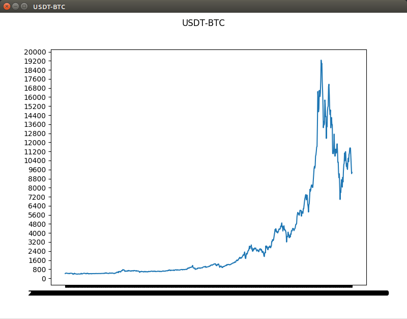

=================
historical-crypto
=================

Usage
-----

Fetch raw historical data

.. code::

    f = Fetcher(marketName = "USDT-BTC", startDate = "0000000000000", interval = "fiveMin")
    print(f.getData())

           BV             C             H             L             O             T                     V
    0      32427.395389   8522.010000   8560.000000   8522.010000   8522.100000   2018-02-13T16:20:00   3.792131
    1      68987.781957   8558.000000   8558.000000   8551.000000   8551.000000   2018-02-13T16:25:00   8.061529
    2     113110.575639   8550.000000   8569.850000   8550.000000   8558.000000   2018-02-13T16:30:00  13.220658
    3      49433.752272   8528.000000   8569.850000   8525.050000   8569.850000   2018-02-13T16:35:00   5.788649
    4      38849.236146   8510.100000   8535.000000   8510.100000   8528.000000   2018-02-13T16:40:00   4.559432
    5     100444.393436   8499.000000   8510.100000   8489.000000   8510.100000   2018-02-13T16:45:00  11.809743
    6     271289.275515   8516.550000   8521.000000   8490.000000   8490.000000   2018-02-13T16:50:00  31.901419
    7     428580.901623   8541.000000   8568.000000   8529.000000   8529.000000   2018-02-13T16:55:00  50.162028
    8      24719.918831   8567.000000   8568.000000   8545.000000   8568.000000   2018-02-13T17:00:00   2.886439
    9      80036.195487   8565.000000   8566.899000   8540.000000   8560.000000   2018-02-13T17:05:00   9.359740
    10     69359.724509   8555.000000   8566.000000   8517.290000   8566.000000   2018-02-13T17:10:00   8.111760

Graph historical data

.. code::

    f = Fetcher(marketName = "USDT-BTC", startDate = "0000000000000", interval = "fiveMin")
    f.plot()

License
-------

MIT License

Copyright (c) 2018 Andrew Porter

Permission is hereby granted, free of charge, to any person obtaining a copy
of this software and associated documentation files (the "Software"), to deal
in the Software without restriction, including without limitation the rights
to use, copy, modify, merge, publish, distribute, sublicense, and/or sell
copies of the Software, and to permit persons to whom the Software is
furnished to do so, subject to the following conditions:

The above copyright notice and this permission notice shall be included in all
copies or substantial portions of the Software.

THE SOFTWARE IS PROVIDED "AS IS", WITHOUT WARRANTY OF ANY KIND, EXPRESS OR
IMPLIED, INCLUDING BUT NOT LIMITED TO THE WARRANTIES OF MERCHANTABILITY,
FITNESS FOR A PARTICULAR PURPOSE AND NONINFRINGEMENT. IN NO EVENT SHALL THE
AUTHORS OR COPYRIGHT HOLDERS BE LIABLE FOR ANY CLAIM, DAMAGES OR OTHER
LIABILITY, WHETHER IN AN ACTION OF CONTRACT, TORT OR OTHERWISE, ARISING FROM,
OUT OF OR IN CONNECTION WITH THE SOFTWARE OR THE USE OR OTHER DEALINGS IN THE
SOFTWARE.
